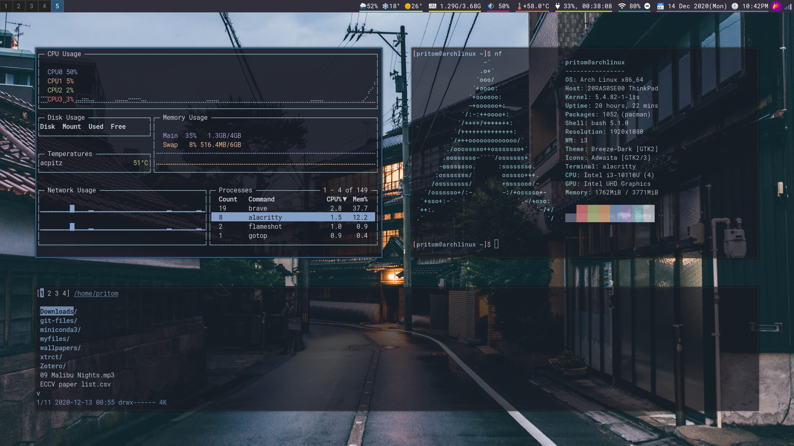
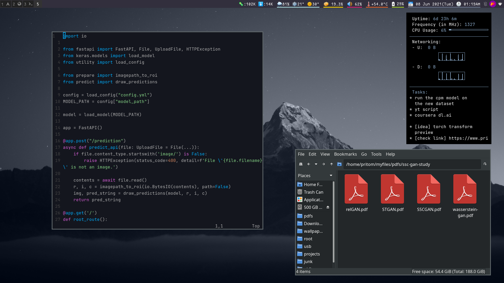

# dotfiles

I now maintain two linux installations, one on my thinkpad and the other on my dell so one use of this repo is to help sync the configs and another reason is to help the general linux TWM audience in case they happen to need my configs.

### good-stuff
* look for good bash aliases - `.bashrc`
* my vim and neovim configs - `.vimrc` & `.config/neovim/init.vim`
* my i3 and i3blocks config - `.config/i3/config` & `.config/i3blocks/config`
* alacritty terminal config - `.config/alacritty/alacritty.yaml`
* picom config - `.config/picom.conf`

### cool scripts in `scripts`
* i3blocks statusbar scripts - `statusbar/`
* doff - system shutdown control menu using dmenu
* dpomo - a bash script that makes use of [this pomodoro timer script](https://github.com/jsspencer/pomo) to provide a dmenu prompt with useful options
* electron-menu - dmenu prompt for launching my electron-apps
* installdate - create a list of all installed packages sorted by *install date*
* mpdnotify - provides notifications for song change in a *ncmpcpp+mpd* setup
* toggle-X - scripts to toggle program X
* ytp-old - play the best matched video on youtube using `mpv --no-video`. It has been superceded by my new bash alias that allows to choose the preferred video from the search results using [youtube-viewer](https://github.com/trizen/youtube-viewer).
* ytplaypause - this scripts uses `xdotool` to quickly pause/play an youtube video playing in any i3 workspace
* cdfz - quickly change directory using `fzf` and `ripgrep`
* dclipboard - opens a dmenu prompt that offers various actions to perform on clipboard content. Inspired from @bugswriter's script
* dmoji - luke's dmenu emoji script
* dmonitor-select - use dmenu to switch between monitor configs
* dpcmanfm - launch `pcmanfm` at a directory chosen via `dmenu`
* drecord - record screen using `ffmpeg` (needs work)
* fixwacom - I use dual monitors and a wacom graphics tablet so this script is used to map the tablet to a single screen.
* infwall - run, wallpaper changes every 4 s, `ctrl-c` when a suitable set of wallpaper appears
* mathq - tool to help practice math so that your brain works the next time you stare at a store cashier.
* ocr-script - use `imagemagick` to recognize text on screen and copy to clipboard. useful for preparing notes from slides or videos.
* tuxil - pipes the output of `tuxi` to the `bat` for automatic paging.

### rice images

